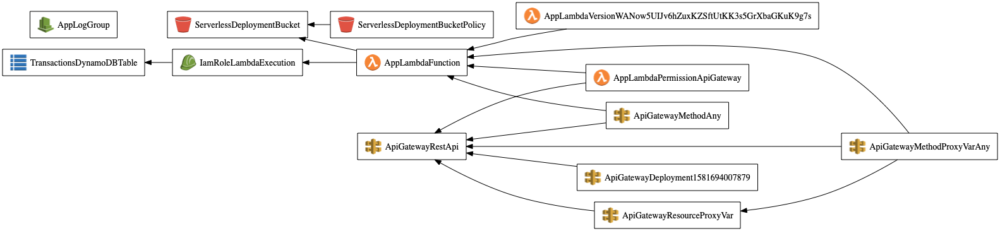

<h1 align=center>Robert Griffith - FT Cloud Engineer Tech Test Solution</h1>

<div align="center">

[Setup ](#setup) |
[Usage ](#usage) |
[Process ](#process) |
[Architecture ](#architecture)|
[Challenges ](#challenges) |
[Extending](#extending)

</div>


API base URL:
<a href="https://ldqccsas74.execute-api.eu-west-2.amazonaws.com/dev">https://ldqccsas74.execute-api.eu-west-2.amazonaws.com/dev (Deprecated)<a>
  
# Setup
To interact with all aspects of this code you must have an AWS account and credentials must be supplied. To check if you have credentials stored on your computer type in the following command into the terminal.
`cat ~/.aws/credentials`

If the credentials are not present, make sure you set up an AIM user and save your credentials in the following format:

```shell
[default]
aws_access_key_id = <YOUR_ACCESS_KEY>
aws_secret_access_key = <YOUR_SECRET_KEY>
```

Clone this repo and cd into the resulting directory.
Install packages and set up the virtual environment.

`npm install` <br>
`virtualenv venv --python=python3`<br>
`source venv/bin/activate`<br>
`pip install -r requirements.txt` <br>

Install DynamoDB locally:<br>
`sls dynamodb install`<br>

## Running The Api Locally
To run the app locally you will need two terminals. In the first terminal enter:<br>
`sls dynamodb start`<br>

In the second terminal enter:<br>
`sls wsgi serve`

You should now be able to visit `http://localhost:5000` and access the API.

## Deploying to AWS
To deploy to AWS, simply enter:<br>
`sls deploy`

This will deploy the infrastructure based on the configuration that is specified in serverless.yml and provide you with a URL endpoint from which you can access the API.

# Usage
First activate the virtual environment and enter the python REPL:
```shell
(venv) (base) $>> source venv/bin/activate`
(venv) (base) $>> python
Python 3.7.4 (default, Aug 13 2019, 15:17:50) 
[Clang 4.0.1 (tags/RELEASE_401/final)] :: Anaconda, Inc. on darwin
Type "help", "copyright", "credits" or "license" for more information.
```
From here you can import the models and start interacting.
```shell
>>> from lib.Statement import Statement
>>> from lib.Account import Account
>>> my_account = Account(1000)
>>> my_account.balance
1000.0
```
Here we have made an account object and initialzed it a starting balance of 1000. If the starting balance is not supplied, the account will be initialzed with a balance of 0.
Every time we deposit or withdraw money from the account the balance is updated
```shell
>>> my_account.add_transaction("deposit", 1000)
<lib.Transaction.Transaction object at 0x10b66e210>
>>> my_account.add_transaction("withdraw", 500)
<lib.Transaction.Transaction object at 0x10b66e810>
>>> my_account.balance
1500.0
```
If we want to print a statement, we simply pass the account object to the statement class and print it.
```shell
>>> print(Statement.make(my_account))
date || credit || debit || balance
14/02/2020 || 1000.00 || || 2000.00
14/02/2020 || || 500.00 || 1500.00
```
`add_transaction` also accepts a third optional argument that specifies the transaction date. If this argument is not supplied, then the transaction date is set to today. The transaction date argument can be supplied in the format of dd/mm/yyy, dd-mm-yyyy or as an epoch timestamp.
```shell
>>> my_account.add_transaction("withdraw", 700, '10-10-2020')
>>> my_account.add_transaction("deposit", 800, '10-10-2020')
<lib.Transaction.Transaction object at 0x10b65fad0>
>>> print(Statement.make(my_account))
14/02/2020 || 1000.00 || || 2000.00
14/02/2020 || || 500.00 || 1500.00
10/10/2020 || || 700.00 || 800.00
15/10/2020 || 800.00 || || 1600.00
```
The transactions must be entered in chronological order for the statement to print correctly.

Input for transactions is validated:
```shell
>>> account = Account()
>>> account.add_transaction("withdrawal", 800)
'Invalid Transaction Type'
>>> account.add_transaction("deposit", "hello")
'Amount must be a number'
>>> account.add_transaction("deposit", -300)
'Amount must be positive'
```

Withdrawals will be blocked if there are insufficient funds:

```shell
>>> account = Account()
>>> account.add_transaction("withdraw", 400)
'Insufficient Funds'
```

# API
The API portion of this solution represents a single account. You can deposit and withdraw money, return a json file containing all transactions and have a statement returned through the following 3 endpoints:

`POST /transactions/add`<br>
`GET /transactions/all`<br>
`GET /statement`

When adding transactions you must supply the transaction type, transaction amount and the current account balance.

```shell
$ curl -H "Content-Type: application/json" -X POST https://ldqccsas74.execute-api.eu-west-2.amazonaws.com/dev/transactions/add -d '{"transactionType": "deposit", "transactionAmount": "500", "accountBalance": "500"}'
```

To get all transactions you can run the following command:
```shell
$ curl -H "Content-Type: application/json" -X GET https://ldqccsas74.execute-api.eu-west-2.amazonaws.com/dev/transactions/all
```
To get a statement using the API run the following command:
```shell
$ curl -H "Content-Type: application/json" -X GET https://ldqccsas74.execute-api.eu-west-2.amazonaws.com/dev/statement
```

# Tests

To run the tests simply enter `npm run test` into the console. This will provide test results and coverage.

```shell
---------- coverage: platform darwin, python 3.7.4-final-0 -----------
Name                                                                 Stmts   Miss  Cover
----------------------------------------------------------------------------------------
tests/account_deposit_test.py                                           34      0   100%
tests/account_init_test.py                                              13      0   100%
tests/account_withdraw_test.py                                          25      0   100%
tests/features/add_transaction_deposit_test.py                           7      0   100%
tests/features/add_transaction_withdraw_insufficient_funds_test.py       4      0   100%
tests/features/add_transaction_withdraw_test.py                          7      0   100%
tests/features/statement_no_date_feature_test.py                         9      0   100%
tests/features/statement_with_date_input_test.py                        14      0   100%
tests/statement_test.py                                                 41      0   100%
tests/validate_test.py                                                  42      0   100%
----------------------------------------------------------------------------------------
TOTAL                                                                  196      0   100%


======================================================== 44 passed in 2.27s ========================================================
```
# Process

## Models
#### The Account Class

Initially, the Account class was made up of 4 functions: `deposit`, `withdraw`, `add_transaction` and `sufficient_funds`.
I noticed that the deposit and withdraw functions were very similar. As a result, I decided to merge them into the add_transaction class. This made the code DRY and easier to maintain. I also decided that sufficient_funds belonged in the Validate class. What we are left with is a class with two functions. One that adds a transaction, and another to handle the amount being transacted when a withdrawal is made.

```python
class Account:
  def __init__(self, start_bal = 0):
    self.balance = start_bal if Validate.is_number(start_bal) else 0
    self.ledger = []

  def add_transaction(self, transaction_type, amount, transaction_date=datetime.today()):
    transaction_date = Validate.date_is_supplied(self, transaction_date)
    if Validate.transaction(amount, transaction_type, self.balance):
      amount = self.handle_amount(amount, transaction_type)
      self.balance += amount
      transaction = Transaction(amount, transaction_type, transaction_date)
      self.ledger.append([transaction, self.balance])
      return transaction
    return Validate.error_message(amount, transaction_type, self.balance)

  def handle_amount(self, amount, transaction_type):
    if transaction_type == "withdraw":
      amount = amount * -1
    return float(amount)
```

#### The Transaction Class

The Transaction class simply consists of attributes representing the date that the transaction was made, the transaction type and amount of money being transacted. While this could have easily been handled using a python dictionary, extracting these elements into a class makes it easier to extend functionality should one choose to do so.
```python
class Transaction:
  def __init__(self, amount, transaction_type, date):
    self.date = date
    self.transaction_type = transaction_type
    self.amount = amount
```

#### The Validate Class
This class was made specifically to Validate input. Initially, input validation was integrated into each model but as they grew it made sense to extract these functions into the Validate class. I ensured that the functions were named semantically to make the code more readable.

```python
Validate.is_positive_number(20) # => True
Validate.date_format("10-10-2020") # => True
Validate.date_format("10.10.2020") # => False
```

If I had more time I would have refactored some of the functions in this class. It would have been good to use regex to check data input was valid. This would have been a more efficient use of code.

#### Statement Class
This class returns a statement when passed an account object: <br>
It is comprised of 3 functions: <br>
  `headers()` returns the headers of the Statement. <br>
  `format_transaction(record)` formats a single transaction. <br>
  `format_items(record)` ensures that numbers are returned to 2 decimal places <br>
  `make(account)` returns a complete statement as a string. <br>

```python
class Statement:
  def headers():
    return 'date || credit || debit || balance\n'

  def format_transaction(record):
    items = Statement.format_items(record)
    if record[0].transaction_type == "deposit":
      return "{} || {} || || {}\n".format(items[0], items[1], items[2])
    elif record[0].transaction_type == "withdraw":
      return "{} || || {} || {}\n".format(items[0], items[1], items[2])

  def format_items(record):
    date = record[0].date
    if type(date) == float:
      date = datetime.fromtimestamp(date)
    date = date.strftime("%d/%m/%Y")
    amount = ('%.2f' % abs(record[0].amount))
    balance = ('%.2f' % record[1])
    return [date, amount, balance]

  def make(account):
    headers = Statement.headers()
    output_string = ""
    for record in account.ledger:
      output_string += Statement.format_transaction(record)
    return (headers + output_string)[:-1]
```

#### Continuous Integration
I used Travis CI for continuous integration. This meant that I was confident that all tests were passing and that branches were safe to merge.

## Architecture
The infrastructure for this app was created using the Serverless framework. Elements of the infrastructure are specified  in a single file. Deployment is handled with a single command. This allows you to modify and maintain the infrastructure with ease.

The static files are stored in an AWS S3 container. The app is served using an API Gateway and code is executed using a Lambda function. Records can be stored in a DynamoDB database.<br>

The API is hosted in the eu-west-2 region (London). I picked London since this is where most people will be accessing the app from. If I had more time I would have looked into deploying to multiple regions so that if one were to go down, the app would still be accessible.

The schema keys for the database are specified in the serverless.yml file. I used the transaction ID as the partition key and timestamp as the Sort key so that the records could be sorted by timestamp. I purposefully omitted DeleteItem as an action for the DB since deleting bank account records would likely not be permitted in a real-life situation.

I also set up the app to be deployed locally on localhost. This enabled testing and increased development speed.

Below is a map of how the infrastructure is set up.:
<br>

<br>
#### Challenges

I faced numerous challenges while building this serverless app. Chief among them was having to learn so many new technologies in such a short timespan. Other than making object-oriented programs in python, almost everything else was new.

Another challenge was dealing with DynamoDB. DynamoDB is a noSQL database that uses a hash function to organise data across partitions. This means that data is not necessarily stored in the order in which it is inputted. To combat this, I stored the dates in the database as timestamps. This would theoretically allow me to order the records based on when they were entered. I used the boto3 client to interact with the database and stored each of the record ID's as a UUID to ensure that records were unique.

I also faced issues storing numbers in the database, the boto3 client was rejecting int and float values which meant that they had to be converted into string values going into the database and back to number values when coming out. This was not ideal and if I had more time I would have liked to conduct more research into this issue. 

I would have probably used mongoDB instead of DynamoDB given more time. Since the records are essentially a time series, a noSQL structure makes sense. MongoDB however, would have also allowed me to sort values in the database by any of the attributes and this would have made more sense in hindsight.

## Extending

There are several ways in which one could enhance/extend this solution. 

- Access Management: 
As it stands, the IAM user I am using has admin privileges and while this works, I could have limited access privileges more.

- Withdrawals with the API:
The API does not currently protect against making withdrawals when there is not enough money in the account. As it stands, you can add transactions to the API but it does not validate the balance.

- Monitoring: 
This would allow one to be aware of issues with the AWS servers should they arise.

- DB class:
It would have made sense to extract interactions with the database into it's own class.

- Continuous deployment: 
This would have been useful since the app would never be deployed without running tests first. This wasn't a major issue in the end since serverless makes it so easy to deploy the app.

